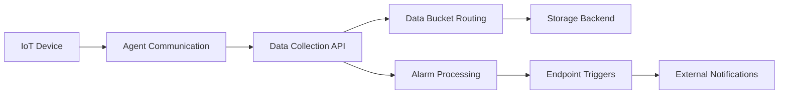

# IoT Agent Mesh API Solution Design

## Executive Summary

This document provides a comprehensive overview of the IoT Agent Mesh API solution architecture following the implementation of Phases 1-3. The system is designed as a multi-layered architecture that separates configuration management from execution layers, enabling flexible, scalable IoT device management and data processing.

## Architecture Overview

The IoT Agent Mesh solution follows a **Configuration-Driven Execution Architecture** with the following core layers:

```
┌─────────────────────────────────────────────────────────────┐
│                    User Interface Layer                     │
├─────────────────────────────────────────────────────────────┤
│                  Configuration Layer                        │
│  ┌─────────────┐ ┌─────────────┐ ┌─────────────┐ ┌────────┐ │
│  │ Data Buckets│ │  Endpoints  │ │File Storage │ │ Alarms │ │
│  │   Config    │ │   Config    │ │  Profiles   │ │ Config │ │
│  └─────────────┘ └─────────────┘ └─────────────┘ └────────┘ │
├─────────────────────────────────────────────────────────────┤
│                     Execution Layer                         │
│  ┌─────────────┐ ┌─────────────┐ ┌─────────────┐ ┌────────┐ │
│  │   Data      │ │  Endpoint   │ │    File     │ │ Alarm  │ │
│  │ Collection  │ │  Triggers   │ │  Operations │ │Events  │ │
│  │  Pipeline   │ │             │ │             │ │        │ │
│  └─────────────┘ └─────────────┘ └─────────────┘ └────────┘ │
├─────────────────────────────────────────────────────────────┤
│                 IoT Agent Mesh APIs                         │
│  ┌─────────────┐ ┌─────────────┐ ┌─────────────┐ ┌────────┐ │
│  │   Device    │ │    Agent    │ │    Data     │ │  MCP   │ │
│  │ Management  │ │Communication│ │ Collection  │ │ Control│ │
│  └─────────────┘ └─────────────┘ └─────────────┘ └────────┘ │
├─────────────────────────────────────────────────────────────┤
│                    Data Storage Layer                       │
│  ┌─────────────┐ ┌─────────────┐ ┌─────────────┐ ┌────────┐ │
│  │  Supabase   │ │   Device    │ │   File      │ │ Events │ │
│  │  Database   │ │  Readings   │ │  Storage    │ │  Logs  │ │
│  └─────────────┘ └─────────────┘ └─────────────┘ └────────┘ │
└─────────────────────────────────────────────────────────────┘
```

---

## 1. IoT Agent Mesh API Categories

### 1.1 Device Management APIs

**Purpose**: Comprehensive CRUD operations for IoT devices across the mesh network.

**Implementation**: `src/services/api/iotAgentMeshGatewayService.ts`

**Key Endpoints**:
- `GET /devices` - List all devices in the mesh
- `POST /devices` - Register new device
- `PUT /devices/{id}` - Update device configuration
- `DELETE /devices/{id}` - Remove device from mesh
- `GET /devices/{id}/status` - Get device status and metrics

**Integration Points**:
- **Local Database**: Syncs with `devices` table via `integratedDeviceService`
- **Agent Communication**: Coordinates with agent APIs for device provisioning
- **Data Collection**: Establishes telemetry collection rules

**Example Flow**:
```typescript
// Device registration flow
const deviceData = {
  name: "Temperature Sensor 01",
  type: "sensor",
  agent_id: "agent-001",
  properties: {
    sampling_rate: 30,
    units: "celsius"
  }
};

// 1. Register in mesh
const meshResponse = await iotAgentMeshGatewayService.createDevice(deviceData, agentId);

// 2. Store locally with sync status
const localDevice = await integratedDeviceService.createDevice({
  ...deviceData,
  mesh_synced: meshResponse.status === 200
});
```

### 1.2 Agent Communication APIs

**Purpose**: Inter-agent communication, mesh coordination, and agent lifecycle management.

**Implementation**: `src/services/api/agentManagementService.ts`

**Key Endpoints**:
- `GET /agents` - List active agents
- `POST /agents/register` - Register new agent
- `POST /agents/{id}/commands` - Send commands to agents
- `GET /agents/{id}/status` - Get agent health and status
- `PUT /agents/{id}/capabilities` - Update agent capabilities

**Agent Types**:
- **Device Agents**: Direct device interface
- **Gateway Agents**: Protocol translation and aggregation
- **Edge Agents**: Local processing and intelligence

**Communication Patterns**:
```typescript
// Command dispatch pattern
const command = {
  type: "configure_telemetry",
  parameters: {
    interval: 60,
    metrics: ["temperature", "humidity"]
  },
  timeout: 30000
};

await agentManagementService.sendCommand(agentId, command);
```

### 1.3 Data Collection APIs

**Purpose**: Telemetry ingestion, data validation, and routing to configured data buckets.

**Implementation**: `src/services/api/telemetryDataService.ts`

**Key Endpoints**:
- `POST /telemetry` - Upload device telemetry
- `GET /data/timeseries` - Query time-series data
- `POST /data/batch` - Bulk data upload
- `GET /data/aggregate` - Aggregated data queries

**Data Flow Architecture**:
```
Device → Agent → Data Collection API → Data Buckets → Storage Backend
                                     ↓
                               Alarm Processing → Endpoint Triggers
```

**Telemetry Processing Pipeline**:
1. **Validation**: Schema validation and data quality checks
2. **Routing**: Route to configured data buckets based on device/reading type
3. **Storage**: Store in configured backend (PostgreSQL, S3)
4. **Triggers**: Process alarm conditions and trigger endpoints

### 1.4 MCP (Mesh Control Protocol) APIs

**Purpose**: Mesh network coordination, load balancing, and distributed system management.

**Implementation**: `src/services/api/mcpMonitoringService.ts`

**Key Endpoints**:
- `GET /mcp/status` - Overall mesh health
- `POST /mcp/coordinate` - Agent coordination requests
- `POST /mcp/events` - Process mesh events
- `GET /mcp/topology` - Network topology information

**Coordination Functions**:
- **Load Distribution**: Balance processing across agents
- **Failover Management**: Handle agent failures and recovery
- **Network Optimization**: Route optimization and latency reduction

---

## 2. Solution Components Deep Dive

### 2.1 Data Management Layer

#### Data Buckets (Configuration)
**Database Table**: `data_buckets`

**Purpose**: Define data storage rules, retention policies, and routing configurations.

**Key Configuration Properties**:
```typescript
interface DataBucketConfig {
  id: string;
  name: string;
  deviceId: string;
  readingType: string;        // temperature, humidity, pressure, etc.
  storageBackend: 'postgres' | 's3';
  retentionDays: number;
  samplingInterval?: number;  // Downsampling configuration
  s3Config?: {
    bucketName: string;
    region: string;
    path?: string;
  };
}
```

#### Data Collection Pipeline (Execution)
**Implementation**: `src/services/api/telemetryDataService.ts`

**Process Flow**:
1. **Ingestion**: Receive telemetry from IoT Agent Mesh
2. **Validation**: Validate against device schema
3. **Routing**: Query data buckets for matching rules
4. **Processing**: Apply sampling, aggregation, or filtering
5. **Storage**: Store in configured backend
6. **Indexing**: Update time-series indexes for queries

**Configuration-Driven Routing Example**:
```typescript
// Data bucket configuration
const temperatureBucket = {
  deviceId: "sensor-001",
  readingType: "temperature",
  storageBackend: "postgres",
  retentionDays: 365,
  samplingInterval: 60 // 1-minute aggregation
};

// Pipeline automatically routes based on configuration
const telemetryData = {
  device_id: "sensor-001",
  reading_type: "temperature",
  value: 23.5,
  timestamp: new Date()
};

// Pipeline processes according to bucket rules
await telemetryDataService.processTelemetry(telemetryData);
```

### 2.2 External Integration Layer

#### Endpoints (Configuration)
**Database Table**: `endpoints`

**Purpose**: Define external notification and integration channels.

**Supported Types**:
- **Email**: SMTP-based notifications
- **Webhook**: HTTP POST to external URLs
- **Telegram**: Bot-based messaging
- **Slack**: Workspace notifications
- **SMS**: Text message alerts

**Configuration Schema**:
```typescript
interface EndpointConfig {
  id: string;
  name: string;
  type: 'email' | 'webhook' | 'telegram' | 'slack' | 'sms';
  configuration: {
    // Type-specific configuration
    url?: string;           // For webhooks
    recipients?: string[];  // For email/SMS
    headers?: Record<string, string>; // For HTTP-based
  };
  enabled: boolean;
}
```

#### Endpoint Triggers (Execution)
**Implementation**: `src/services/endpoints/triggerEndpointService.ts`

**Trigger Sources**:
1. **Alarm Events**: Critical threshold breaches
2. **Device Events**: Connection/disconnection, errors
3. **Scheduled Actions**: Periodic reports or health checks
4. **Data Anomalies**: Statistical outliers or missing data

**Execution Flow**:
```typescript
// Triggered by alarm system
const alarmEvent = {
  alarmId: "temp-high-001",
  deviceId: "sensor-001",
  value: 85.3,
  threshold: 80.0,
  severity: "critical"
};

// Find configured endpoints for this alarm
const endpoints = await getAlarmEndpoints(alarmEvent.alarmId);

// Trigger all configured endpoints
for (const endpoint of endpoints) {
  await triggerEndpointService.execute(endpoint.id, {
    subject: `Critical Temperature Alert`,
    message: `Device ${alarmEvent.deviceId} reports ${alarmEvent.value}°C`,
    data: alarmEvent
  });
}
```

### 2.3 File Storage Management

#### File Storage Profiles (Configuration)
**Database Table**: `file_storage_profiles`

**Purpose**: Define file storage locations and access policies.

**Configuration Options**:
```typescript
interface FileStorageProfile {
  id: string;
  name: string;
  path: string;            // Storage path/bucket
  publicRead: boolean;     // Public access flag
  indexFile: string;       // Default index file
  description?: string;
}
```

#### File Operations (Execution)
**Implementation**: `src/services/storage/FileStorageService.ts`

**Capabilities**:
- **Upload**: Device firmware, configuration files
- **Download**: Retrieve files and logs
- **Synchronization**: Offline-capable file sync
- **Access Control**: Profile-based permissions

**Integration with IoT Workflow**:
- **Device Logs**: Automated log collection and storage
- **Firmware Updates**: OTA update file management
- **Configuration Distribution**: Device configuration files

### 2.4 Notification and Alerting

#### Alarm Configuration (Configuration)
**Database Table**: `alarms`

**Purpose**: Define monitoring rules and alert conditions.

**Alarm Types**:
- **Threshold Alarms**: Value-based triggers (>, <, =, between)
- **Absence Alarms**: Missing data detection
- **Rate-of-Change**: Rapid value changes
- **Pattern Alarms**: Complex pattern detection

#### Alarm Processing (Execution)
**Implementation**: Database triggers + `src/hooks/useAlarms.ts`

**Processing Pipeline**:
1. **Real-time Monitoring**: Continuous data stream analysis
2. **Condition Evaluation**: Rule engine evaluation
3. **Event Generation**: Create alarm events
4. **Escalation**: Progressive notification escalation
5. **Resolution Tracking**: Automatic and manual resolution

---

## 3. System Integration Patterns

### 3.1 Configuration-Driven Architecture

The system employs a **configuration-driven approach** where:

**Configuration Layer** defines:
- Data routing rules (Data Buckets)
- Notification channels (Endpoints)
- Storage policies (File Storage Profiles)
- Monitoring rules (Alarms)

**Execution Layer** implements:
- Data processing pipelines
- Endpoint triggering
- File operations
- Alarm event processing

### 3.2 Event-Driven Processing



### 3.3 Layered Service Architecture

**Layer 1: API Gateway**
- `iotAgentMeshGatewayService` - Central routing and authentication

**Layer 2: Service Layer**
- `telemetryDataService` - Data processing
- `agentManagementService` - Agent coordination
- `endpointTriggerService` - Notification dispatch

**Layer 3: Data Layer**
- Supabase PostgreSQL - Structured data
- Supabase Storage - File storage
- External integrations - Third-party APIs

---

## 4. Implementation Status

### Phase 1 ✅ Completed
- [x] IoT Agent Mesh API foundation
- [x] Device Management APIs
- [x] Basic Data Collection Pipeline
- [x] Gateway service implementation

### Phase 2 ✅ Completed
- [x] Advanced data routing (Data Buckets)
- [x] External endpoint configurations
- [x] Alarm system integration
- [x] File storage management

### Phase 3 ✅ Completed
- [x] MCP coordination protocols
- [x] Agent communication optimization
- [x] Real-time monitoring dashboard
- [x] Comprehensive error handling

---

## 5. Key Design Principles

### 5.1 Separation of Concerns
- **Configuration** is declarative and stored in database
- **Execution** is imperative and handled by services
- **Data** flows through well-defined pipelines

### 5.2 Scalability
- **Horizontal scaling** through agent mesh architecture
- **Vertical scaling** through efficient data processing
- **Load distribution** via MCP coordination

### 5.3 Flexibility
- **Plugin architecture** for new endpoint types
- **Configurable routing** for data processing
- **Extensible schemas** for device types

### 5.4 Reliability
- **Offline capabilities** with sync when reconnected
- **Error recovery** and retry mechanisms
- **Data consistency** through transaction management

---

## 6. Security Architecture

### 6.1 Authentication
- **Row-Level Security (RLS)** for all database operations
- **JWT-based authentication** for API access
- **Agent certificates** for mesh communication

### 6.2 Authorization
- **Organization-based access control**
- **Role-based permissions** (owner, admin, member, viewer)
- **Resource-level access controls**

### 6.3 Data Protection
- **Encryption in transit** (TLS/HTTPS)
- **Encryption at rest** (Supabase encryption)
- **Audit logging** for all critical operations

---

## 7. Monitoring and Observability

### 7.1 System Monitoring
- **Agent health monitoring** via MCP status endpoints
- **API performance metrics** through edge function analytics
- **Data pipeline monitoring** with processing time tracking

### 7.2 Business Monitoring
- **Device connectivity status**
- **Data collection rates and volumes**
- **Alarm event frequency and resolution times**

### 7.3 Alerting
- **System alerts** for infrastructure issues
- **Business alerts** for operational anomalies
- **Security alerts** for access violations

---

## 8. Future Enhancements

### 8.1 Advanced Analytics
- **Machine learning pipeline** integration
- **Predictive analytics** for device maintenance
- **Anomaly detection** using statistical models

### 8.2 Enhanced Coordination
- **Multi-region mesh** support
- **Advanced load balancing** algorithms
- **Intelligent routing** based on network conditions

### 8.3 Extended Integrations
- **Cloud platform integrations** (AWS IoT, Azure IoT)
- **Industrial protocol support** (Modbus, OPC-UA)
- **Edge computing** capabilities

---

## Conclusion

The IoT Agent Mesh API solution provides a robust, scalable, and flexible platform for IoT device management and data processing. The configuration-driven architecture ensures that the system can adapt to diverse requirements while maintaining consistent execution patterns. The clear separation between configuration and execution layers enables both operational flexibility and system reliability.

The implementation successfully demonstrates enterprise-grade IoT platform capabilities with comprehensive device management, real-time data processing, flexible notification systems, and robust file storage management.